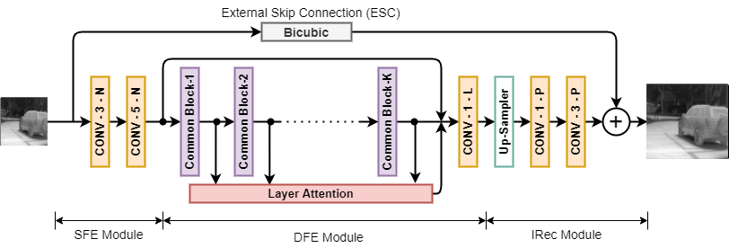
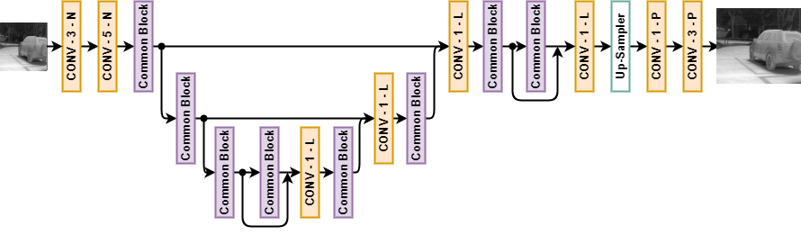
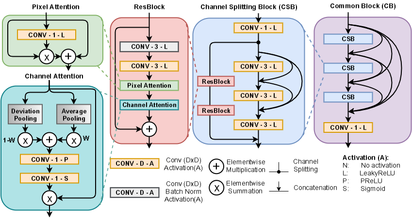

The repository contains the official code for the work "Channel Split Convolutional Neural Network (ChaSNet) for Thermal ImageSuper-Resolution" accepted for PBVS-2021 workshop in-conjuction with CVPR-2021 conference.

The pre-trained model for track-2 (i.e. scaling of x2) is shared in the repository while the pre-trained model for the track-1 (i.e. scaling of x4) can be download from "https://drive.google.com/file/d/1jpCZn1bDX2qSUKYc_2Q5bpBGsF_p0sCr/view?usp=sharing".
